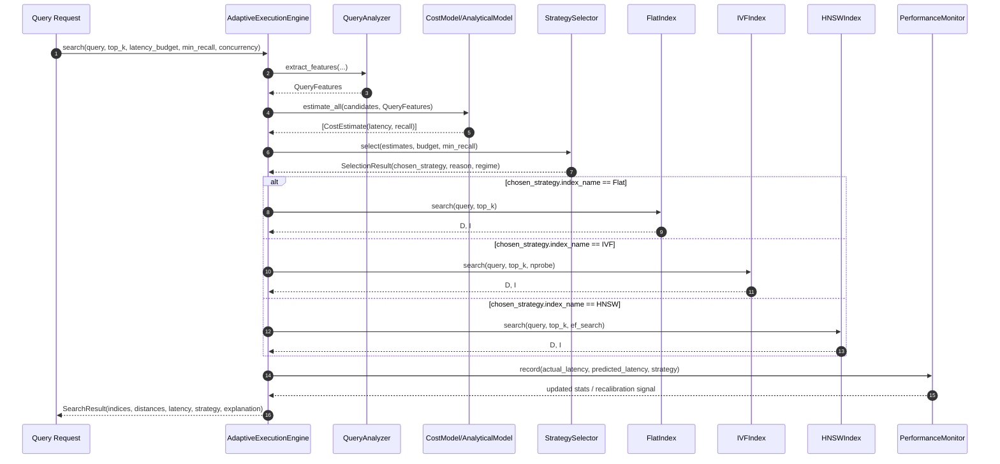

# ADT-Project

**Cost-Aware, Query-Time Adaptive Execution Framework for Vector Similarity Search**

## Quick Start

### 1. Setup Environment

```bash
# Create virtual environment
python -m venv venv

# Activate (Windows)
venv\Scripts\activate

# Install dependencies
pip install -r requirements.txt
```

### 2. Download Dataset (~500MB)

```bash
python data/download_datasets.py
```

### 3. Run Phase 1 — Baseline Benchmark

```bash
python experiments/01_baseline_benchmark.py
```

Output: `results/baseline_results.csv`

### 4. Run Phase 2 — Profiling & Failure Analysis

```bash
python experiments/02_profiling_analysis.py
```

Output: `results/profiling_sweep.csv` + `results/figures/*.png`

### 5. Generate Plots Separately (if needed)

```bash
python experiments/visualize_profiling.py
```

### 6. Run Phase 3 — Adaptive Evaluation

```bash
python experiments/03_adaptive_evaluation.py
```

Output: `results/adaptive_summary.txt` + `result/adaptive_evaluation.csv`

### 7. Run Phase 4 — Analyze Experiment Results

```bash
python experiments/result_analysis.py
```

Output: `results/analysis_summary.txt` + `results/analysis_tables.csv`

## Project Structure

```
ADT-Project/
├── config/default_config.yaml    # All configurable parameters
├── data/                         # Datasets (downloaded, not committed)
├── src/
│   ├── indexes/                  # Flat, IVF, HNSW index wrappers
│   ├── profiler/                 # Latency & recall profiling
│   └── utils/                    # Metrics, I/O helpers
├── experiments/                  # Runnable scripts for each phase
│   ├── 01_baseline_benchmark.py
│   ├── 02_profiling_analysis.py
│   ├── 03_adaptive_evaluation.py
│   └── 04_result_analysis.py     # Result aggregation & summary
├── results/                      # Output CSV and figures
└── requirements.txt
```

## Datasets

- **SIFT1M**: 1M vectors, 128d, L2 distance (primary)
- **GloVe-100**: 1.2M vectors, 100d, angular distance (secondary)

## Architecture Diagrams

Two Mermaid source files are included for report-ready system diagrams:

- `docs/diagrams/adaptive_execution_sequence.mmd`
  - Figure title: **Adaptive Query-Time Execution Sequence Diagram**
- `docs/diagrams/strategy_selection_state.mmd`
  - Figure title: **Strategy Selection State Diagram**

### Export to SVG/PNG

Option A (Web):

1. Open https://mermaid.live
2. Paste `.mmd` content
3. Export as SVG or PNG

Option B (CLI):

```bash
npm i -g @mermaid-js/mermaid-cli
mmdc -i docs/diagrams/adaptive_execution_sequence.mmd -o docs/diagrams/adaptive_execution_sequence.svg
mmdc -i docs/diagrams/strategy_selection_state.mmd -o docs/diagrams/strategy_selection_state.svg
```

Use SVG in reports for best print quality.

### GitHub Preview (Mermaid)

The following Mermaid block is rendered directly on GitHub:


