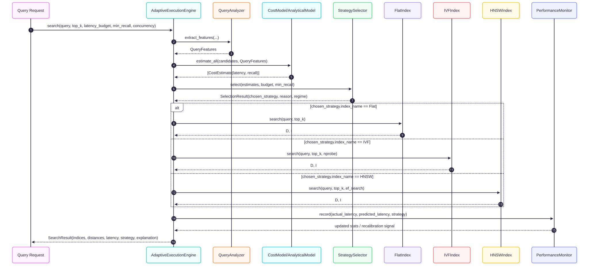
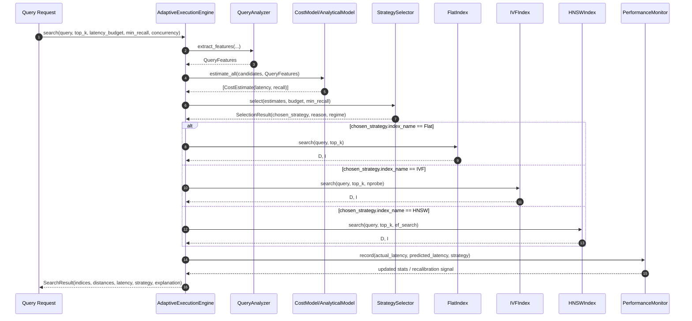
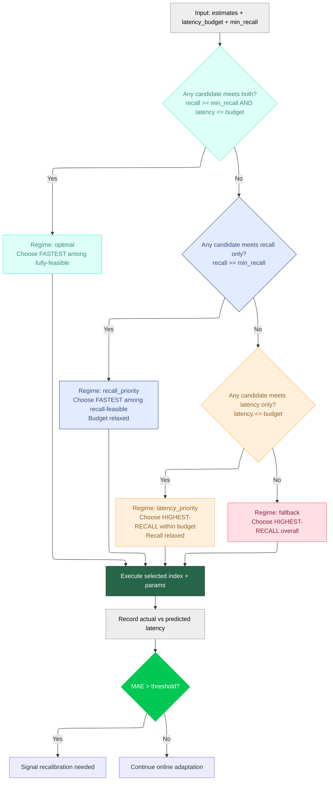
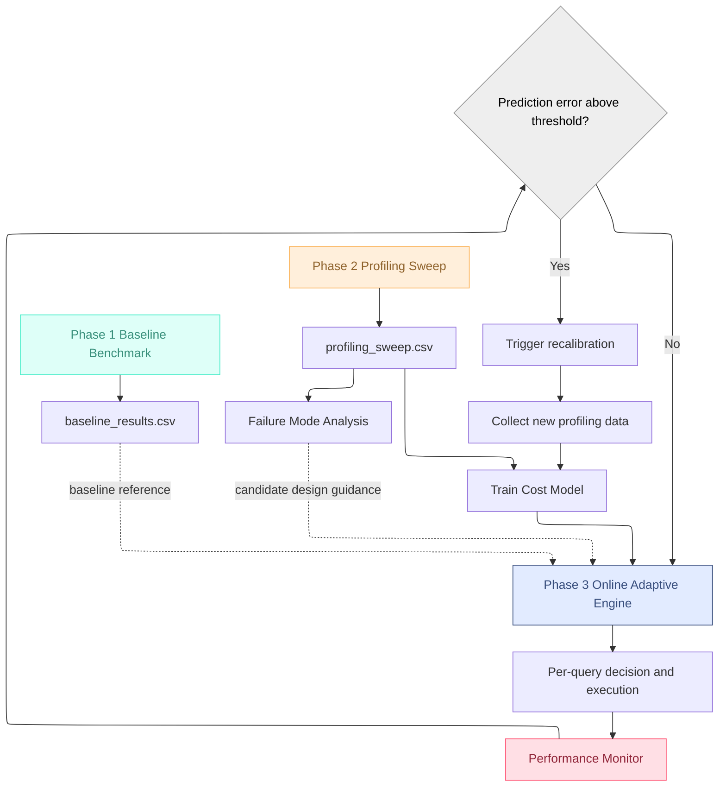

# ADT-Project

**Cost-Aware, Query-Time Adaptive Execution Framework for Vector Similarity Search**

## Quick Start

### 1. Setup Environment

```bash
# Create virtual environment
python -m venv venv
# If used python3
python3 -m venv venv

# Activate (Windows)
venv\Scripts\activate

# Activate (Mac/Linux)
source venv/bin/activate

# Install dependencies
pip install -r requirements.txt
```

After activation, use `python` for all commands below.

### 2. Download Dataset (~500MB)

```bash
python data/download_datasets.py
```

### 3. Run Phase 1 — Baseline Benchmark

```bash
python experiments/01_baseline_benchmark.py
```

Output: `results/baseline_results.csv`

### 4. Run Phase 2 — Profiling & Failure Analysis

```bash
python experiments/02_profiling_analysis.py
```

Output: `results/profiling_sweep.csv` + `results/figures/*.png`

### 5. Generate Plots Separately (if needed)

```bash
python experiments/visualize_profiling.py
```

### 6. Run Phase 3 — Adaptive Evaluation

```bash
python experiments/03_adaptive_evaluation.py
```

Output: `results/adaptive_summary.txt` + `results/adaptive_evaluation.csv`

### 7. Run Phase 4 — Analyze Experiment Results

```bash
python experiments/result_analysis.py
```

Output: `results/analysis_summary.txt` + `results/analysis_tables.csv`

### 8. Exit python virtual environment

Enter the following directly in the terminal:

```bash
deactivate
```

## Project Structure

```
ADT-Project/
├── config/default_config.yaml    # All configurable parameters
├── data/                         # Datasets (downloaded, not committed)
├── src/
│   ├── indexes/                  # Flat, IVF, HNSW index wrappers
│   ├── profiler/                 # Latency & recall profiling
│   └── utils/                    # Metrics, I/O helpers
├── experiments/                  # Runnable scripts for each phase
│   ├── 01_baseline_benchmark.py
│   ├── 02_profiling_analysis.py
│   ├── 03_adaptive_evaluation.py
│   └── result_analysis.py        # Result aggregation & summary
├── results/                      # Output CSV and figures
└── requirements.txt
```

## Datasets

- **SIFT1M**: 1M vectors, 128d, L2 distance (primary)
- **GloVe-100**: 1.2M vectors, 100d, angular distance (secondary)

## Architecture Diagrams

Two Mermaid source files are included for report-ready system diagrams:

- `docs/diagrams/adaptive_execution_sequence.mmd`
  - Figure title: **Adaptive Query-Time Execution Sequence Diagram**
- `docs/diagrams/strategy_selection_state.mmd`
  - Figure title: **Strategy Selection State Diagram**
- `docs/diagrams/offline_online_closed_loop.mmd`
  - Figure title: **Offline-Online Closed Loop Diagram**

### Export to SVG/PNG

Option A (Web):

1. Open https://mermaid.live
2. Paste `.mmd` content
3. Export as SVG or PNG

Option B (CLI):

```bash
npm i -g @mermaid-js/mermaid-cli
mmdc -i docs/diagrams/adaptive_execution_sequence.mmd -o docs/diagrams/adaptive_execution_sequence.svg
mmdc -i docs/diagrams/strategy_selection_state.mmd -o docs/diagrams/strategy_selection_state.svg
mmdc -i docs/diagrams/offline_online_closed_loop.mmd -o docs/diagrams/offline_online_closed_loop.svg

# If your diagrams folder is at repository root:
# mmdc -i diagrams/adaptive_execution_sequence.mmd -o diagrams/adaptive_execution_sequence.svg
```

Use SVG in reports for best print quality.

### GitHub Preview (Mermaid)

The following Mermaid block is rendered directly on GitHub:

Adaptive execution sequence image:




```mermaid
sequenceDiagram
  autonumber
  participant Client as Query Request
  participant Engine as AdaptiveExecutionEngine
  participant Analyzer as QueryAnalyzer
  participant Model as CostModel/AnalyticalModel
  participant Selector as StrategySelector
  participant Flat as FlatIndex
  participant IVF as IVFIndex
  participant HNSW as HNSWIndex
  participant Monitor as PerformanceMonitor

  Client->>Engine: search(query, top_k, latency_budget, min_recall, concurrency)
  Engine->>Analyzer: extract_features(...)
  Analyzer-->>Engine: QueryFeatures

  Engine->>Model: estimate_all(candidates, QueryFeatures)
  Model-->>Engine: [CostEstimate(latency, recall)]

  Engine->>Selector: select(estimates, budget, min_recall)
  Selector-->>Engine: SelectionResult(chosen_strategy, reason, regime)

  alt chosen_strategy.index_name == Flat
    Engine->>Flat: search(query, top_k)
    Flat-->>Engine: D, I
  else chosen_strategy.index_name == IVF
    Engine->>IVF: search(query, top_k, nprobe)
    IVF-->>Engine: D, I
  else chosen_strategy.index_name == HNSW
    Engine->>HNSW: search(query, top_k, ef_search)
    HNSW-->>Engine: D, I
  end

  Engine->>Monitor: record(actual_latency, predicted_latency, strategy)
  Monitor-->>Engine: updated stats / recalibration signal

  Engine-->>Client: SearchResult(indices, distances, latency, strategy, explanation)
```

Strategy selection state diagram:


```mermaid
---
config:
  layout: elk
---
flowchart TB
    A["Input: estimates + latency_budget + min_recall"] --> B{"Any candidate meets both?<br>recall &gt;= min_recall AND latency &lt;= budget"}
    B -- Yes --> C["Regime: optimal<br>Choose FASTEST among fully-feasible"]
    B -- No --> D{"Any candidate meets recall only?<br>recall &gt;= min_recall"}
    D -- Yes --> E["Regime: recall_priority<br>Choose FASTEST among recall-feasible<br>Budget relaxed"]
    D -- No --> F{"Any candidate meets latency only?<br>latency &lt;= budget"}
    F -- Yes --> G["Regime: latency_priority<br>Choose HIGHEST-RECALL within budget<br>Recall relaxed"]
    F -- No --> H["Regime: fallback<br>Choose HIGHEST-RECALL overall"]
    C --> Z["Execute selected index + params"]
    E --> Z
    G --> Z
    H --> Z
    Z --> M["Record actual vs predicted latency"]
    M --> N{"MAE > threshold?"}
    N -- Yes --> R["Signal recalibration needed"]
    N -- No --> S["Continue online adaptation"]

     A:::Ash
     B:::Aqua
     C:::Aqua
     D:::Sky
     E:::Sky
     F:::Peach
     G:::Peach
     H:::Rose
     Z:::Pine
     M:::Ash
     N:::Rose
    classDef Aqua stroke-width:1px, stroke-dasharray:none, stroke:#46EDC8, fill:#DEFFF8, color:#378E7A
    classDef Sky stroke-width:1px, stroke-dasharray:none, stroke:#374D7C, fill:#E2EBFF, color:#374D7C
    classDef Peach stroke-width:1px, stroke-dasharray:none, stroke:#FBB35A, fill:#FFEFDB, color:#8F632D
    classDef Pine stroke-width:1px, stroke-dasharray:none, stroke:#254336, fill:#27654A, color:#FFFFFF
    classDef Ash stroke-width:1px, stroke-dasharray:none, stroke:#999999, fill:#EEEEEE, color:#000000
    classDef Rose stroke-width:1px, stroke-dasharray:none, stroke:#FF5978, fill:#FFDFE5, color:#8E2236
    style N fill:#00C853,color:#FFFFFF,stroke:#00C853
```

Offline-online closed loop diagram:


```mermaid
---
config:
  layout: elk
---
flowchart TB
    P1["Phase 1 Baseline Benchmark"] --> B1["baseline_results.csv"]
    P2["Phase 2 Profiling Sweep"] --> B2["profiling_sweep.csv"]
    B2 --> F1["Failure Mode Analysis"] & T1["Train Cost Model"]
    T1 --> O1["Phase 3 Online Adaptive Engine"]
    O1 --> D1["Per-query decision and execution"]
    D1 --> M1["Performance Monitor"]
    M1 --> C1{"Prediction error above threshold?"}
    C1 -- No --> O1
    C1 -- Yes --> R1["Trigger recalibration"]
    R1 --> N1["Collect new profiling data"]
    N1 --> T1
    B1 -. baseline reference .-> O1
    F1 -. candidate design guidance .-> O1

     P1:::Aqua
     P2:::Peach
     O1:::Sky
     M1:::Rose
     C1:::Ash
    classDef Aqua stroke-width:1px, stroke-dasharray:none, stroke:#46EDC8, fill:#DEFFF8, color:#378E7A
    classDef Peach stroke-width:1px, stroke-dasharray:none, stroke:#FBB35A, fill:#FFEFDB, color:#8F632D
    classDef Sky stroke-width:1px, stroke-dasharray:none, stroke:#374D7C, fill:#E2EBFF, color:#374D7C
    classDef Rose stroke-width:1px, stroke-dasharray:none, stroke:#FF5978, fill:#FFDFE5, color:#8E2236
    classDef Ash stroke-width:1px, stroke-dasharray:none, stroke:#999999, fill:#EEEEEE, color:#000000
```
